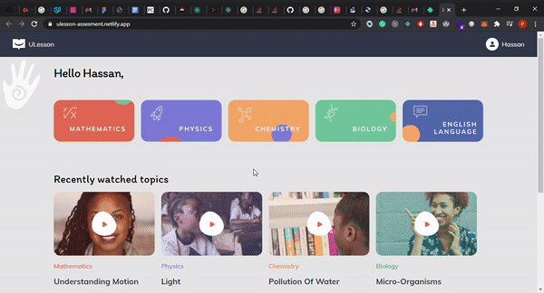

## Ulesson

## Requirement and Installation
This project requires you to have **Node** and  **Git** installed in your system.

## To run this project clone the repo.
* open your command line
* run `git clone https://github.com/chekwas88/ulesson.git`
* cd into ulesson

* Run `npm install or yarn install` on the command line to install all packages.

* Run `npm start or yarn start` to start up the project locally.

## NOTE
For the chapter page, the API provided was used to get the page data
## Built With

- React
- Styled Component
- React Player
* You can view the live app at https://ulesson-assesment.netlify.app/

